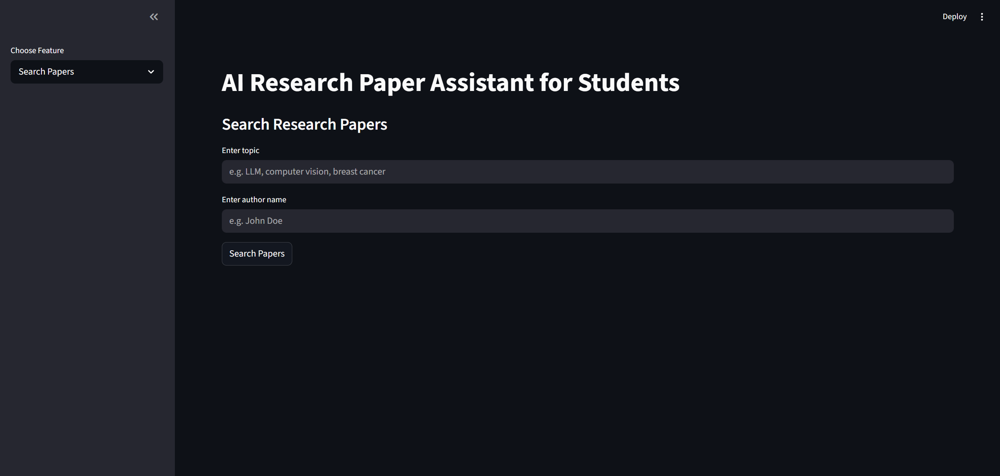
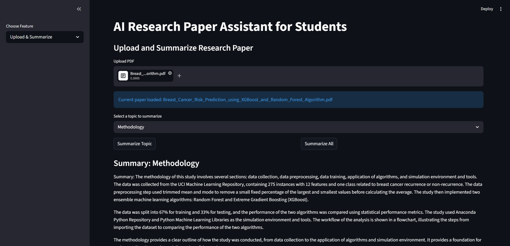
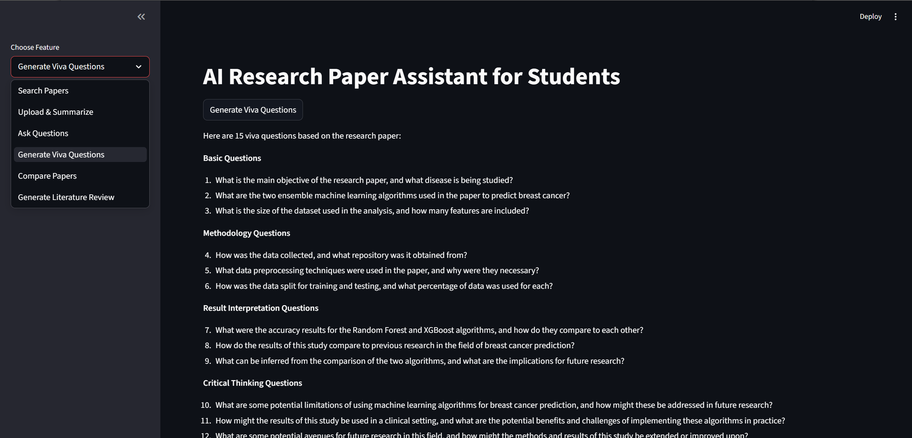
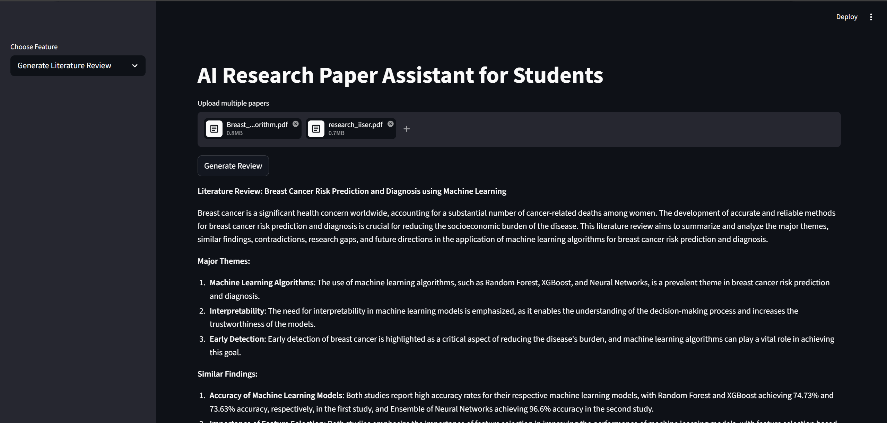

# ResearchMate — AI Research Paper Assistant


ResearchMate is an AI-powered research assistant built for students and researchers to simplify academic paper discovery, understanding, comparison, and analysis.

It combines research paper search, summarization, retrieval-augmented question answering (RAG), literature review generation, paper comparison, and viva question generation in a single application.

---

## Features

### Research Paper Discovery
- Search research papers by topic  
- Search research papers by author  
- Search using topic + author together  
- Retrieve metadata including:
  - Title
  - Authors
  - Abstract
  - Publication year
  - Paper link

---

## Upload and Summarize
Upload a research paper PDF and:

- Extract major paper topics automatically  
- Summarize selected topics  
- Generate full paper summaries  
- Produce structured summaries with:
  - Summary
  - Key bullet points

---

## Chat with Research Papers (RAG)
Ask questions directly from uploaded papers using Retrieval-Augmented Generation.

Examples:
- What methodology is used?
- What are the main results?
- What are the limitations?
- How many pages does this paper have?

Features:
- Context-aware Q&A  
- Follow-up questions  
- Persistent chat history during session  
- Supporting context retrieval

---

## Generate Viva Questions
Automatically generate viva or defense questions from uploaded research papers.

Includes:
- Basic conceptual questions  
- Methodology questions  
- Result interpretation questions  
- Critical-thinking questions

---

## Compare Two Papers
Upload two papers and compare:

- Problem statement  
- Methodology  
- Dataset  
- Results  
- Limitations

---

## Generate Literature Review
Upload multiple papers and generate:

- Major themes  
- Similar findings  
- Contradictions  
- Research gaps  
- Future research directions

---

## Tech Stack

### Frontend
- Streamlit

### Backend
- Python

### AI / LLM
- Groq API (Llama 3.3 70B)

### Retrieval / Vector Search
- Sentence Transformers  
- ChromaDB / FAISS

### Research Paper Search
- OpenAlex API

### PDF Processing
- PyMuPDF

---

## Project Architecture

```text
User Input
   ↓

Streamlit Interface
   ↓

PDF Processing
   ↓

Topic Extraction
   ↓

Embeddings + Vector Store
   ↓

RAG Question Answering / Summarization / Comparison / Literature Review
   ↓

Groq LLM Response
```

---

## Installation

Clone the repository:

```bash
git clone https://github.com/23f3001369/ResearchMate.git
cd ResearchMate
```

Create virtual environment:

```bash
python -m venv researchenv
```

Activate environment:

Windows:

```bash
researchenv\Scripts\activate
```

Install dependencies:

```bash
pip install -r requirements.txt
```

---

## Environment Variables

Create a `.env` file:

```env
GROQ_API_KEY=your_api_key_here
```

---

## Run the App

```bash
streamlit run app.py
```

---

## Example Use Cases

- Understand research papers faster  
- Prepare for viva examinations  
- Compare related papers  
- Generate literature reviews  
- Chat with academic papers  
- Discover relevant research

---

## Future Improvements

- Citation-backed answers  
- Related paper recommendations  
- Auto slide generation from papers  
- Research gap detection  
- User authentication and saved chat history

---

## Screenshots
## Screenshots

### Home Page


---

### Upload and Summarize


---

### Chat with Paper


---

### Viva Questions


---

### Literature Review Generator



---

## Author

Aman Sagar

---

## License

MIT License
